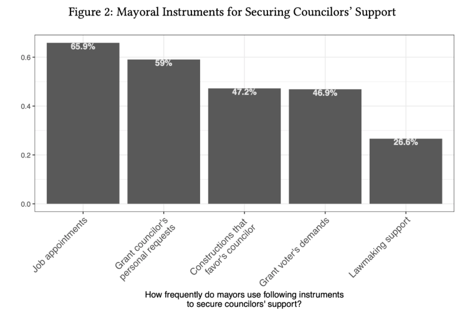

```{r xaringan-themer, include=FALSE, warning=FALSE}
options(htmltools.dir.version = FALSE)
list.of.packages <- c("xaringan", "xaringanthemer")
new.packages <- list.of.packages[!(list.of.packages %in% installed.packages()[,"Package"])]
if(length(new.packages)) install.packages(new.packages)

library(xaringanthemer)
style_mono_accent(
  base_color = "#1c5253",
  header_h1_font_size = "2.25rem",
  header_h2_font_size = "1.85rem",
  header_font_google  = google_font("Josefin Sans"),
  text_font_google    = google_font("Montserrat", "300", "300i"),
  text_font_size      = "1.4rem",
  code_font_google    = google_font("Fira Mono")
)
```

# Motivation

* Institutional design significantly impacts redistributive politics

--

* Yet little is known about the effect of legislative features on policy outcomes

--

* Here we tackle one question that all democracies face in their institution building process: 

--

* **Does increasing legislature size result in better public service delivery?**

---

# Motivation

* The number of legislators affects policymaking, taxation, government spending, and representation

--

* However, larger legislatures not only increase bargaining costs to the government...

--

* ..but they can also be expensive to taxpayers

---

# Motivation

.pull-left[
```{r, cache=TRUE, fig.cap="Councils that cost more than US$ 80.00 per capita (red dots)", echo=FALSE, out.width="80%"}

```
]

.pull-right[
```{r, cache=TRUE, fig.cap="City with highest cost per capita: US$ 400", echo=FALSE}

```
]

---

# What we do

* We propose a formal model to explain how legislature size affects bargaining costs in city councils

* We exploit exogenous variation in Brazilian city council sizes and test whether larger legislatures improve public service provision

* We analyse the contents of 346,553 bills to see whether there is an increase in legislation related to public service delivery

* We run a survey with 174 former councillors to investigate potencial political mechanisms and provide qualitative evidence for our results 

---

# What we find

* Larger city councils change the composition of mayoral coalitions and the number of appointed bureaucrats in the municipality

* The extra city councillor has a 91 percent chance of belonging to the mayor's pre-electoral coalition, what *decreases* the bargaining costs for the mayor and boosts investments in public services

* Municipalities with larger city councils have around 15 percent more public goods provision proposals

---

# What we find

* Increasing city council size by one legislator lowers infant mortality by 2 children per one thousand infants born and reduces post-neonatal mortality by 0.90 children per one thousand infants that survived their first 28 days

* A larger council size also increases enrolment by 2.58 children in elementary education classrooms without diminishing school quality

* **In sum, increasing legislature size does result in better public service provision** (at least in Brazil!)

---

# Number of legislators and social welfare

* Alchian and Demzets (1972): team productivity
  - More legislators: increases productivity frontier but risk of moral hazard

* Weingast et al. (1981): Law of 1/*n*
  - Diffuse costs and concentrated benefits: Free-riding on common pool taxes. Overprovision (?)

* Crain et al. (1979, 1982, 2012): Representation of interest groups
  - Easier to lobby but coordination problems within legislature
  - More representation, better service provision

* Empirical findings: mixed evidence (Freire et al., 2021)

---

# Our theory: bargaining costs and partisanship

* We propose a **legislature bargaining** game:

* The municipality has $R$ resources, and it is comprised of a mayor (Executive) and a city council (Legislative)
* The mayor and the city council bargain over public goods provision and rents
* The mayor's proposal has:
  - A public goods provision level ( $g$ )
  - Rents for the councillors ( $\textbf{x}$ ) and for the mayor ( $r$ )

* If the simple majority of the councillors accept the proposal, it is implemented. Otherwise, it is rejected.

---

# Game timeline

* Timeline:
  - The mayor learns how many government $|G|$ and opposition $|O|$ legislators were elected
  - The mayor proposes a policy vector $(r, g, \textbf{x})_M$
  - The city council votes the proposal

* If the council accepts, policy is implemented and game ends
* Otherwise, the reversal policy is implemented
  
* _Reversal Policy:_ The budget is discounted by a factor $\delta \in (0,1)$, and one councillor is randomly selected to make an offer. If the offer is accepted, it is implemented. If rejected, the reversal policy stage restarts

---

# Governing costs without partisanship

* (_After some algebra, which I'll happily skip here!_)

* In the baseline non-partisan reversal policy, bargaining costs always increase when the size of the legislature increases

.center[
```{r, cache=TRUE, fig.cap="Bargaining costs increase in larger legislatures", echo=FALSE, out.width="50%"}

```
]

---

# Governing costs with partisanship

* If the chances of electing a councillor aligned with the mayor are high, increasing legislature size decreases the costs of governing

* Thus, more public goods provision (and rents)

.center[
```{r, cache=TRUE, fig.cap="Bargaining costs decrease with partisanship", echo=FALSE, out.width="80%"}

```
]

---

# Empirical strategy

* Brazil is the ideal test ground for this theory
  - The country has wide variation in terms of welfare
  - The budget is mostly fixed (transfers)
  - And city council size changed in 2005 and 2008 in a way that allows us to study the effect council size on welfare

* Councils before law change:

.center[
```{r, cache=TRUE, fig.cap="", echo=FALSE, out.width="90%"}

```
] 

---

# Arbitrary council sizes

* Municipalities used to define council sizes inefficiently:

.pull-left[
```{r, cache=TRUE, fig.cap="Nova Russa (25,000 inhabitants and 21 councilors)", echo=FALSE, out.width="90%"}

```
]

.pull-right[
```{r, cache=TRUE, fig.cap="Sorocaba (550,000 inhabitants and 14 councilors)", echo=FALSE, out.width="90%"}

```
]

---

# Mira Estrela

.center[
```{r, cache=TRUE, fig.cap="Mira Estrela: 2,000 inhabitants and 11 councilors", echo=FALSE, out.width="80%"}

```
]

---

# Supreme Court ruling

.center[
```{r, cache=TRUE, fig.cap="", echo=FALSE, out.width="80%"}

```
]

---

# Estimation

* Sharp RD: municipalities close to thresholds are comparable
* Only difference: legislature size
* A perfect RDD estimation relies on three hypothesis: 
  - No manipulation
  - For multiple thresholds: multiplicity correction
  - No pre-treatment variation.

* We developed an estimation technique for the multiple cutoffs problem.

---

# Legislature size, representation, and composition of local chambers

* **_H1_**: Bargaining costs decrease with legislature size when the chance of electing a government-aligned legislator is high
* **_H2_**: Public goods provision increases when bargaining costs decrease

* Alternative hypothesis:
  - **_AH1_**: Female representation increases with legislature size
  - **_AH2_**: Non-whites representation increase with legislature size
  - **_AH3_**: Election competitiveness increases with legislature size
  - **_AH4_**: The legislative production increases with legislature size

---

# Legislature size, representation, and composition of local chambers

.center[
```{r, cache=TRUE, fig.cap="", echo=FALSE, out.width="65%"}

```
]

---

# Effect of legislature size on welfare

.center[
```{r, cache=TRUE, fig.cap="", echo=FALSE, out.width="65%"}

```
]

---

# Evidence from proposed legislation

.center[
```{r, cache=TRUE, fig.cap="", echo=FALSE, out.width="80%"}

```
]

---

# Evidence from former legislators

.center[
```{r, cache=TRUE, fig.cap="", echo=FALSE, out.width="80%"}

```
]

---

# Discussion

* Partisanship considerably decreases bargaining costs, improving welfare

* Increasing the council size results in gains in elementary school enrolment and in lower infant mortality without decreasing school quality

* Our findings are consistent with the hypothesis that former Presidents Cardoso and Lula increased social indicators due to large government coalitions

---

# Discussion

* Implications that extend beyond Brazil. Several countries have local city councils and multiparty systems, so the dynamics we expose here may explain how fragmented legislatives are not synonymous with policy paralysis

* In contrast with well-established theories that point out that multipartism is a peril to democratic regimes

* Our findings may help us understand why countries in Latin America and Asia can generate effective governance despite having strong executives and large coalitions

---

# Further research

* If the mechanism we suggest is indeed at work, more support for the Executive means better public goods
  - How extensive should the city council's checking prerogatives be, as they significantly reduce the provision of public services?

* It remains uncertain how other legislative features affect welfare
  - What is the effect of monetary compensation for councillors and committee structure on public welfare?

--

* **Any suggestions on how to tackle these questions are greatly appreciated! :)**

---

class: center, middle, inverse

# Thank you very much!
